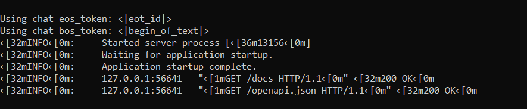

# LLaMA 3.1 Chatbox API (FastAPI)

This project demonstrates a lightweight chatbox service powered by the LLaMA 3.1 language model. It exposes the model via a RESTful API using **FastAPI**, serving as a proof-of-concept for basic AI integration and backend development.

---

##  Assignment Purpose

This project showcases the ability to:

- Integrate a LLaMA-based model in Python
- Develop and deploy a RESTful API with FastAPI
- Validate functionality using Postman

---

##  Technologies Used

| Component       | Technology            |
|----------------|------------------------|
| Model Backend   | LLaMA 3.1 (Python)     |
| API Framework   | FastAPI (Python)       |
| Testing Tool    | Postman                |

---

##  Project Structure

```
.
├── app/
│   ├── main.py             # FastAPI app and routing
│   └── model.py            # LLaMA model loading and inference
├── models/
│   └── LLaMA-3-8B.gguf     # Model file (not tracked in repo)
├── screenshots/
│   ├── postman-demo.png    # Postman test example
│   ├── swagger-ui.png      # Swagger UI screenshot
│   └── server-log.png      # Server running confirmation
├── README.md
├── requirements.txt
└── .gitignore
```

### Model File (Not Included in Repository)

>  Due to file size limitations on GitHub, the quantized model file `Llama-3-8B-Instruct.Q4_K_M.gguf` (~4.8 GB) is **not included** in this repository.

To run the project locally:

1. Download the appropriate GGUF version of the LLaMA 3.1 model from [Meta AI or Hugging Face](https://huggingface.co/TheBloke).
2. Place the file inside the `models/` directory:
   llama_chatbox\models


> The code is configured to load this file automatically from that location.

---

##  API: `/chat` Endpoint

**Method**: `POST`  
**URL**: `http://127.0.0.1:8000/chat`

###  Request Body (JSON)

```json
{
  "message": "Hello!"
}
```

###  Sample Response (JSON)

```json
{
  "reply": "Hello! How can I help you today?"
}
```

---

##  Screenshots

| Description              | File Path                    |
|--------------------------|------------------------------|
| Postman request          | `screenshots/postman-demo.png` |
| Swagger UI (FastAPI Docs) | `screenshots/swagger-ui.png`  |
| Server Startup Console   | `screenshots/server-log.png`  |


## Screenshots

### 1. Postman Test


### 2. Server Running


### 3. Swagger UI


---

## Technical Notes

Although this prototype uses Pythons FastAPI for rapid deployment, a more scalable and decoupled
architecture would involve a separation of concerns:
### Backend-Oriented Architecture Vision
In a real-world system:
- The **LLM (Large Language Model)** remains in Python (for efficient inference and model handling)
- The **API layer could be built with Java Spring Boot** to better reflect enterprise-level backend practices
- The Java backend would **call the Python-based model as a service**, passing user messages and
receiving responses
- Communication could be handled via **HTTP, REST, or gRPC** protocols between the systems


###  Scalable Architecture Plan

- **Inference Layer (Python)**: LLaMA 3.1 remains in Python for efficient model execution.
- **API Gateway (Java Spring Boot)**: Ideal for enterprise applications with microservice support.
- **Communication**: REST or gRPC used between Java (API) and Python (Model).
- **Benefits**: Clear separation of concerns, microservice readiness, language flexibility.

---

##  Future Enhancements

- Use **WebSockets** for real-time message streaming
- Add **React or Vue** frontend for a full-stack chat interface
- **LLM parameter tuning** or multi-turn memory using session-based storage
- Implement **multi-turn memory** or context handling with session-based storage
- Add **Docker support** for containerization

---

##  Conclusion

This proof-of-concept demonstrates basic integration of a local LLM using FastAPI. For future development, I aim to evolve this into a modular microservice-based architecture using Spring Boot (API) and Python (inference), enabling scalable, maintainable, and production-grade AI applications.
